# Ulric Clip Calendar

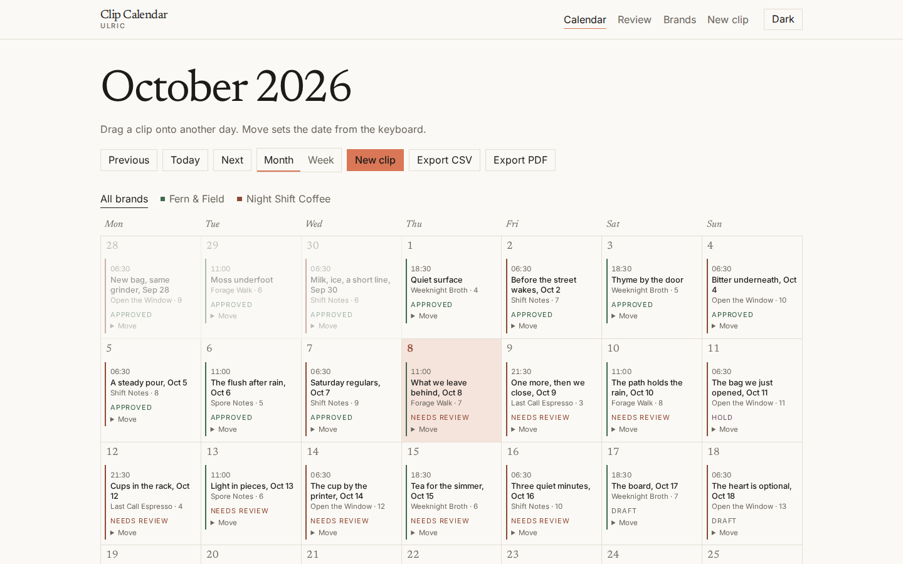

A social clip scheduler for creators and small brands. Upload or link a clip, plan it on a brand calendar, write the caption, and get an approval before anyone posts it. The app does not publish to Instagram, TikTok, YouTube, or Facebook.

By Ulric studio.

## Features

- Brands with a name, color, handles, default hashtags, posting cadence, and a fictional map pin.
- Month and week calendars for one brand or all brands, with drag and drop rescheduling.
- Clip upload or an external link. Uploads are probed with ffprobe, given a 9:16 thumbnail, and can be trimmed with ffmpeg in a background job. The original file stays on disk.
- If ffmpeg is missing, the file is still saved and the UI says thumbnails and trims are paused. The Docker image includes ffmpeg.
- Caption, hashtags, platform targets (IG Reels, TikTok, YT Shorts, FB), series and part, post date and time, and a stories flag.
- Approval status: draft, needs review, approved, or hold. Each clip has a comment thread and a status history.
- Review mode with keyboard shortcuts.
- CSV and PDF export for all brands or one brand.
- Public read-only share links for a brand, a date range, or both. Share pages send a noindex tag.
- Seeded demo brands Fern & Field and Night Shift Coffee, with a three month schedule and free-license clips. See [CREDITS.md](CREDITS.md).
- Light and dark themes. See [Motion](#motion).
- SQLite by default. MySQL is optional, including MAMP's MySQL 5.7.

## Feature tour

### Calendar

The month holds one post on each cadence day. Past posts are approved. Today and the next few days sit in review, with one hold nearby. Drag a clip to another day.


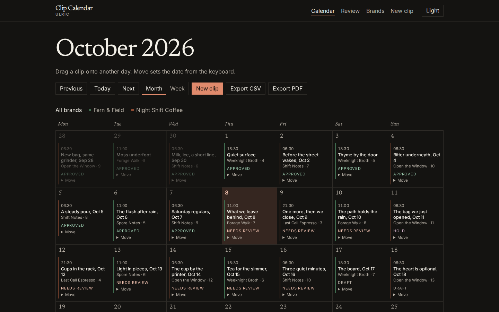

On a phone the month collapses to dots, and the selected day opens underneath.

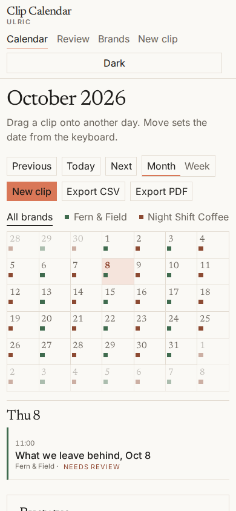

Week view puts the poster's time, title, and status on each card.

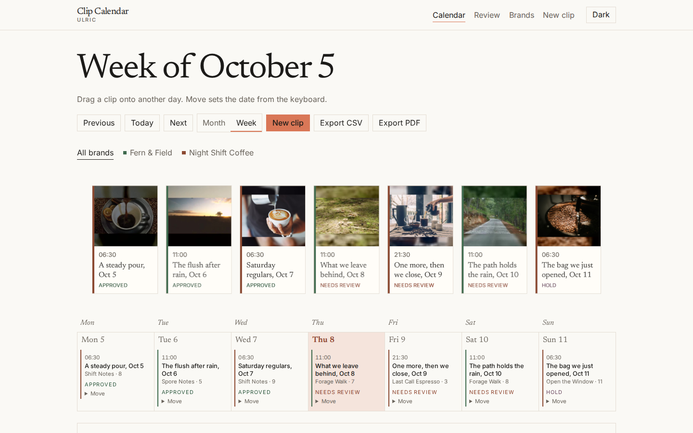

### Review

J and K move through the queue. A approves, H holds, R sends it back to needs review, and D returns it to draft.

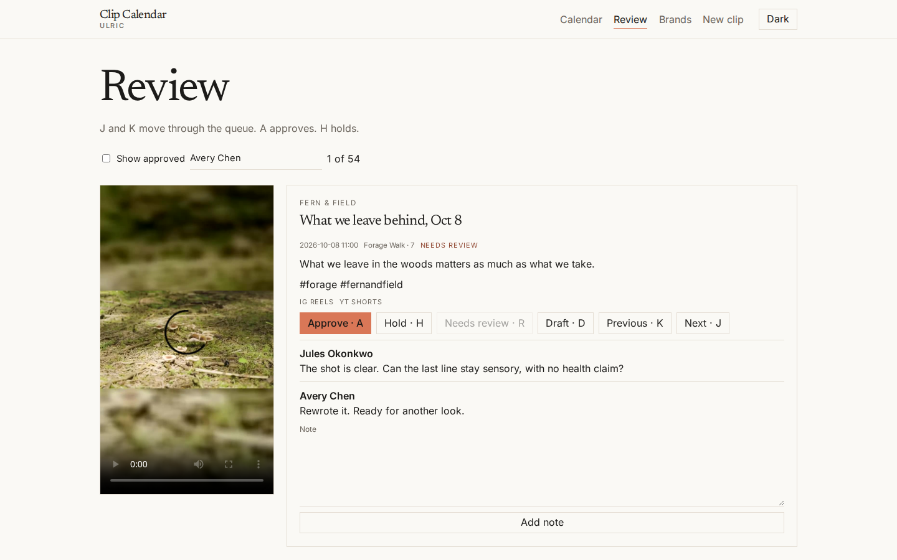

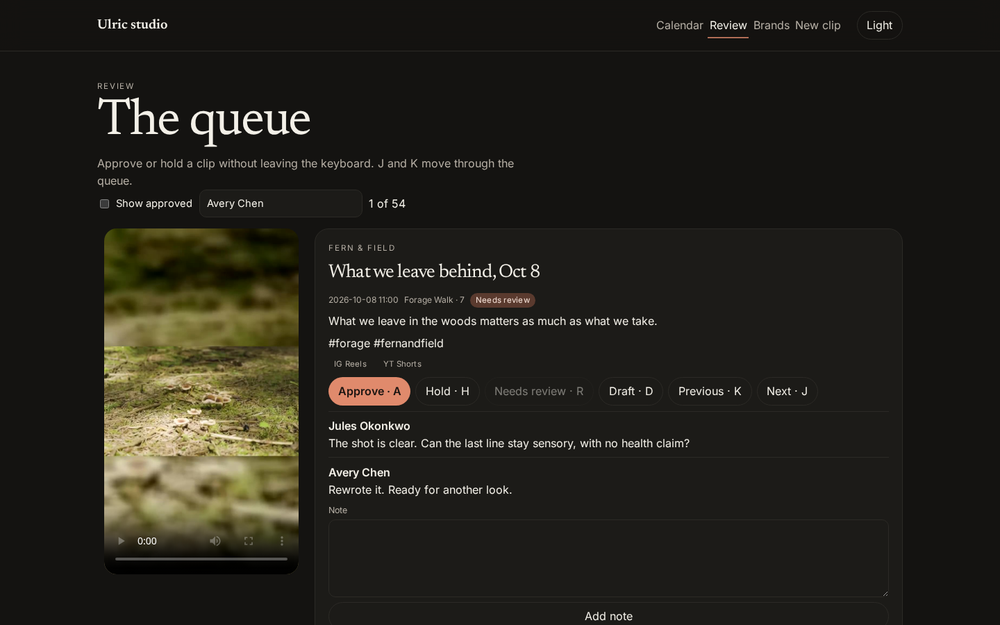

### Editor

Caption, platforms, trim, notes, and status history sit beside the 9:16 preview.

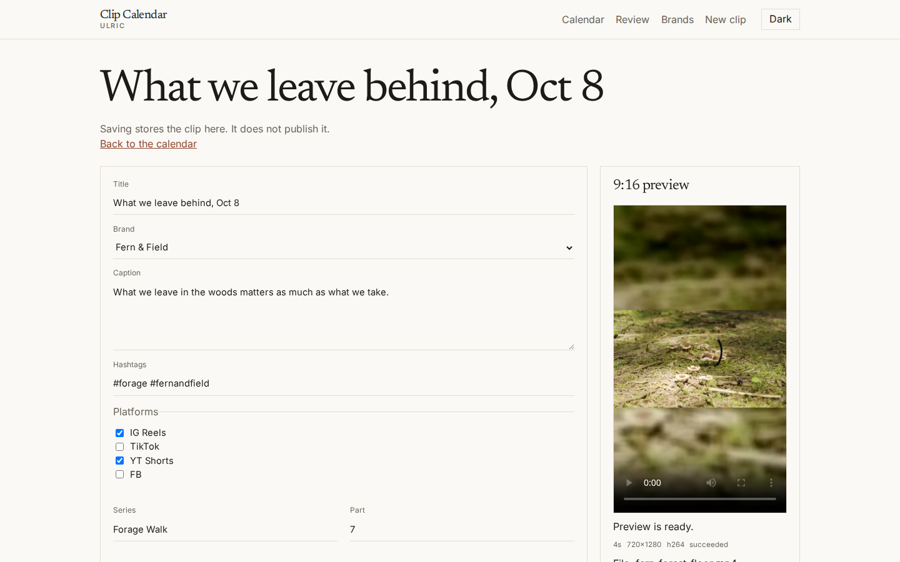

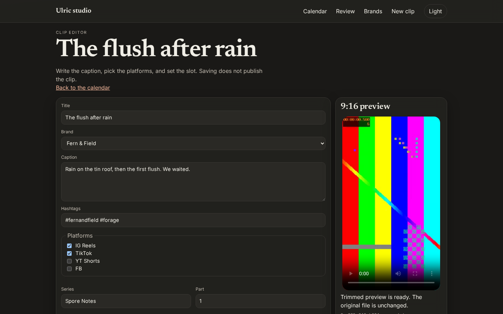

### Brands

Handles, cadence, and a share link for each brand. The map pins are fictional.

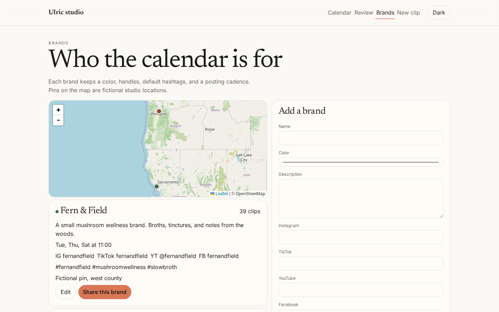

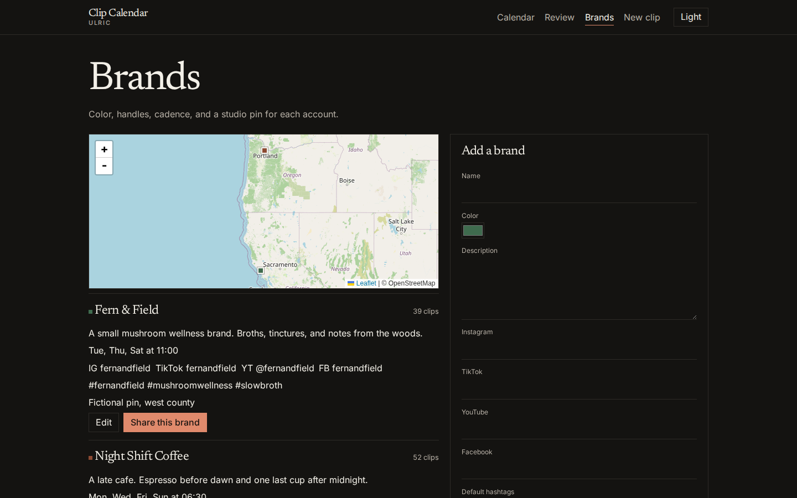

### Share

A token opens a read-only calendar. Unknown tokens 404, and the page asks search engines not to index it.

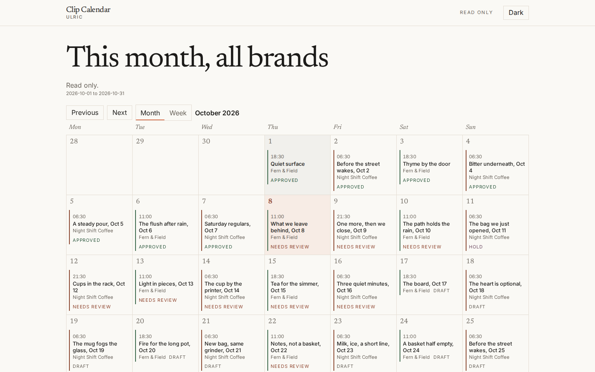

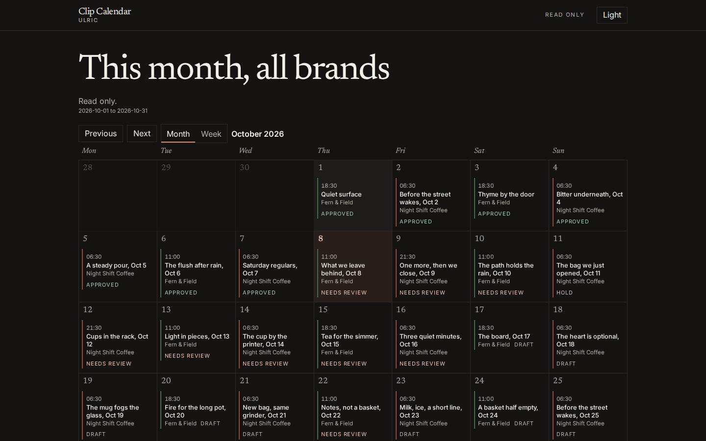

Phone captures for every screen are in [docs/screenshots](docs/screenshots).

## Motion

Pages crossfade on navigation. The first view, and each section inside it, fades and rises 12px over about 340ms with a short stagger. The curve is `cubic-bezier(0.2, 0.7, 0.2, 1)`. Buttons, the month/week switch, and drag targets use a short spring. Theme colors ease between paper and ink.

Counts run up when they enter the viewport. The status ring and the brand bars grow from zero. A line of posts draws across the range, and the area fills after the line. "How a clip moves" is an SVG on the calendar: draft, needs review, approved, and hold.

Week view lazy-loads three.js r170 for a spring-settled card row. Each card is a canvas texture, drawn after the fonts are ready and updated when the poster loads, at a pixel ratio capped at 2. The face shows the thumbnail, time, title, and status. Rendering pauses offscreen. A narrow window, or reduced motion, uses the same cards as a flat row and does not start the 3D scene.

A 24 second Remotion reel sits in `video/` for a portfolio cut. It is not part of CI.

```bash
cd video
npm install
npm run render
```

That writes `video/out/clip-calendar.mp4`.

## Stack

- ASP.NET Core 8 Web API
- Angular 22, standalone components and signals
- EF Core with SQLite, or Pomelo for MySQL
- QuestPDF (Community license) for the schedule PDF
- Chart.js for status and brand counts
- three.js for the week card timeline, loaded only on that view
- Leaflet and OpenStreetMap tiles for brand pins
- ffmpeg and ffprobe for probe, thumbnail, preview, and trim
- xUnit

## Architecture

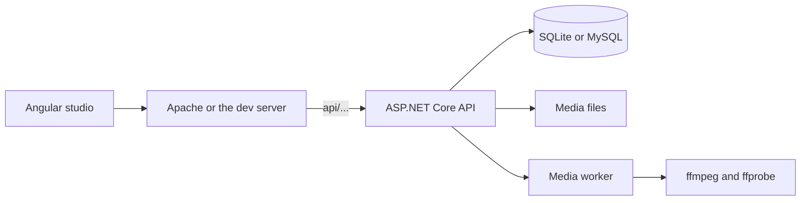

`src/Ulric.ClipCalendar.Api` is the HTTP API, the EF model, the ffmpeg job queue, CSV export, and QuestPDF export. Domain rules for status changes, calendar ranges, CSV rows, and share scope live in `Domain/` and do not depend on the web host.

Uploaded files go under `Storage:Root/media/{clipId}/`. A background worker runs ffprobe, writes a 9:16 JPEG thumbnail, and, when a trim or a non-9:16 source needs it, writes a separate preview. The original upload is kept. Seeded clips already include a preview and a poster, so the first load does not wait on ffmpeg.

`web/` is the Angular client. The calendar, editor, review queue, brand page, and public share page are standalone components. Theme choice is stored in `localStorage` under `ulric-theme`. With no saved choice, the UI follows the system preference.

Share links are 32 random bytes, encoded as base64url. `GET /api/public/{token}` returns only the clips inside that brand and date range. The Angular route `s/{token}` is read only and sets `<meta name="robots" content="noindex, nofollow">`.

## Data model

| Table | What it stores |
| --- | --- |
| Brands | Name, unique slug, color, handles, default hashtags, cadence label and day numbers, default post time, fictional latitude and longitude |
| Clips | Title, caption, hashtags, platforms, series and part, post date and time, stories flag, approval status, source link or file paths, trim, media job state |
| Comments | Author, body, and time on a clip |
| StatusEvents | From status, to status, actor, note, and time |
| ShareLinks | Token, optional brand, optional date range, label |

Approval moves only along the rules in `StatusMachine`: draft to needs review, needs review to approved or hold or draft, hold back to needs review or draft, approved back to needs review. A clip cannot skip from draft to approved.

MySQL tables use `utf8mb4` and `utf8mb4_general_ci`, which MySQL 5.7 and 8 both accept. Indexed strings are short enough for InnoDB on 5.7.

## API

The server routes stay rooted at `/api`. The Angular app calls them as relative `api/...` so a `<base href>` can place the studio in a sub-path. When `PublicBaseUrl` is set, media and share links in JSON and CSV are absolute URLs under that base. When it is empty, those links are relative (`api/clips/{id}/media?kind=preview`, `s/{token}`).

| Method | Path | Purpose |
| --- | --- | --- |
| GET | `/api/health` | Liveness |
| GET | `/api/capabilities` | Whether ffmpeg and ffprobe were found |
| GET | `/api/brands` | List brands |
| GET | `/api/brands/{id}` | One brand |
| POST | `/api/brands` | Create a brand |
| PUT | `/api/brands/{id}` | Update a brand |
| GET | `/api/clips` | List clips. Query: `brandId`, `from`, `to`, `status` |
| GET | `/api/clips/{id}` | Clip with comments and history |
| POST | `/api/clips` | Create a clip |
| PUT | `/api/clips/{id}` | Update caption, schedule fields, and platforms |
| POST | `/api/clips/{id}/file` | Upload a video |
| POST | `/api/clips/{id}/reschedule` | Move the post date or time |
| POST | `/api/clips/{id}/status` | Change approval status |
| POST | `/api/clips/{id}/comments` | Add a note |
| POST | `/api/clips/{id}/trim` | Queue a trim |
| GET | `/api/clips/{id}/media` | `kind=thumbnail` or `kind=preview` |
| GET | `/api/review` | Queue. `includeApproved=true` keeps approved clips |
| GET | `/api/stats` | Status and brand counts for a range |
| GET | `/api/export/csv` | Schedule CSV |
| GET | `/api/export/pdf` | Schedule PDF |
| GET | `/api/shares` | List share links |
| POST | `/api/shares` | Create a share link |
| GET | `/api/public/{token}` | Read-only schedule for that token |
| GET | `/api/public/{token}/media/{clipId}` | Media for a clip inside the token scope |

## Run with Docker

```bash
docker compose up --build
```

Open http://localhost:8080.

Compose starts MySQL 8.4 and the API. The API waits until MySQL is healthy, applies EF migrations, and seeds when the database is empty. `Database:ServerVersion` is left empty so Pomelo detects the server. The compose password `ulric` is a local example, not a production secret.

Media and the SQLite fallback path, if you switch the provider back, live in the `ulric-data` volume. MySQL data lives in `ulric-mysql`. Delete the volumes if you want a fresh seed.

To run the container on SQLite instead, set `Database__Provider=Sqlite` and drop the MySQL dependency.

## Run without Docker

SQLite is the zero-config default.

```bash
dotnet run --project src/Ulric.ClipCalendar.Api
```

The API listens on http://localhost:5080. In Development it also opens Swagger at http://localhost:5080/swagger. `dotnet run --project` writes the SQLite file and media folder to `src/Ulric.ClipCalendar.Api/data`. That folder is gitignored. Startup applies migrations, then seeds when no brands exist.

UI, from `web/`:

```bash
npm install
npm start
```

The dev server runs at http://localhost:4200 and proxies `/api` to http://localhost:5080. The dev `<base href>` is `/`, so relative `api/...` calls still land on `/api/...`.

`npm start` needs Node.js 22.22.3 or newer. ffmpeg and ffprobe should be on your PATH if you want thumbnails and trims for new uploads. Without them, the banner on the calendar explains what is paused. The seeded clips already have previews.

## Deploy under MAMP

This is the layout Eric runs: Apache at `http://localhost:8888/grokbot/asp/ulric-clip-calendar/`, with the API proxied under that same prefix, and MAMP MySQL 5.7.39 on `127.0.0.1:8889`.

The Angular app never calls `/api/...` with a leading slash. Calls, export links, media URLs, and share links are relative to the `<base href>`, unless you set `PublicBaseUrl` and want absolute links in JSON and CSV. Assets and the router follow the base href from the build.

### 1. Build the studio into the sub-path

From `web/`:

```bash
npx ng build --base-href /grokbot/asp/ulric-clip-calendar/
```

The trailing slash matters. The build writes `web/dist/web/browser/`. Copy that folder's contents into the Apache directory that serves the URL, for example the MAMP document root at `htdocs/grokbot/asp/ulric-clip-calendar/`.

`index.html` then contains `<base href="/grokbot/asp/ulric-clip-calendar/">`, and script and style URLs are relative to it.

### 2. Proxy the API

Leave the API on Kestrel at `http://127.0.0.1:5080`. Apache should forward only the `api` prefix and leave the static files to itself. In the MAMP Apache config, load `proxy` and `proxy_http`, then:

```apache
ProxyPass /grokbot/asp/ulric-clip-calendar/api http://127.0.0.1:5080/api
ProxyPassReverse /grokbot/asp/ulric-clip-calendar/api http://127.0.0.1:5080/api
```

Put those lines before a broad `Alias` or rewrite so API calls are not swallowed by the static site.

Deep links such as `/review` need to fall back to `index.html`. Inside the studio directory, or in a `<Directory>` block for it:

```apache
RewriteEngine On
RewriteBase /grokbot/asp/ulric-clip-calendar/
RewriteRule ^api/ - [L]
RewriteCond %{REQUEST_FILENAME} !-f
RewriteCond %{REQUEST_FILENAME} !-d
RewriteRule . /grokbot/asp/ulric-clip-calendar/index.html [L]
```

If you would rather proxy the whole prefix to Kestrel, and let Kestrel serve `wwwroot`, set `PathBase` to `/grokbot/asp/ulric-clip-calendar` and publish the Angular build into the API `wwwroot`. The default MAMP setup above does not need `PathBase`, because Apache strips the prefix before Kestrel sees `/api/...`.

### 3. Point the API at MAMP MySQL 5.7

Create the database in MAMP's MySQL. The server is `127.0.0.1` port `8889`. A stock MAMP install uses user `root` and password `root`. That pair is an example of the MAMP default, written only in `appsettings.Development.example.json`. If your MAMP password is different, use yours in an uncommitted local file. Do not commit a real password.

```sql
CREATE DATABASE ulric CHARACTER SET utf8mb4 COLLATE utf8mb4_general_ci;
```

Copy `src/Ulric.ClipCalendar.Api/appsettings.Development.example.json` over a local `appsettings.Development.json` that you do not commit, or export the same values:

```bash
export Database__Provider=MySql
export Database__ServerVersion=5.7.39-mysql
export ConnectionStrings__MySql="Server=127.0.0.1;Port=8889;Database=ulric;User=root;Password=root;CharSet=utf8mb4;"
export PublicBaseUrl=http://localhost:8888/grokbot/asp/ulric-clip-calendar
export ASPNETCORE_URLS=http://127.0.0.1:5080
dotnet run --project src/Ulric.ClipCalendar.Api
```

`Database:ServerVersion` defaults to empty, which means Pomelo calls `ServerVersion.AutoDetect`. Set `5.7.39-mysql` when you want to skip that round trip or when detection is awkward. The EF migration was generated against the 5.7.39 model: `utf8mb4`, `utf8mb4_general_ci`, `datetime(6)`, `time(6)`, and `char(36)` guids. It does not use MySQL 8-only SQL such as the `utf8mb4_0900` collations. The same migration was applied and seeded on MySQL 5.7.44.

Startup runs `Database.Migrate()` and, when the brand table is empty, copies the files in `seed-media/` into storage and inserts the three month schedule. Delete the MySQL schema if you need to seed again. An older SQLite file is ignored once the provider is MySQL.

`PublicBaseUrl` should be the site origin plus the sub-path, with no trailing slash. CSV clip links and the URLs in API JSON then start with `http://localhost:8888/grokbot/asp/ulric-clip-calendar/`. Leave it empty to keep those links relative.

## MySQL outside MAMP

Any MySQL 5.7 or 8 server works with the same provider. Set `Database:Provider` to `MySql`, set `ConnectionStrings:MySql`, and leave `Database:ServerVersion` empty for auto-detect or set a value Pomelo can parse, such as `8.0.36-mysql` or `5.7.39-mysql`. The connection string should include `CharSet=utf8mb4`.

Switching providers does not migrate data from SQLite to MySQL. Each database is seeded on its own when it has no brands.

## Environment variables

The API reads normal ASP.NET Core configuration. `.env.example` lists the same names. A `.env` file is not loaded unless you export it.

| Variable | Purpose | Default |
| --- | --- | --- |
| `ASPNETCORE_ENVIRONMENT` | `Development` or `Production` | `Development` for `dotnet run` |
| `ASPNETCORE_URLS` | Bind address | `http://localhost:5080` in the launch profile, `http://+:8080` in Docker |
| `Database__Provider` | `Sqlite` or `MySql` | `Sqlite` |
| `Database__ServerVersion` | Pomelo server version, or empty to auto-detect | empty |
| `ConnectionStrings__Default` | SQLite connection string | `Data Source=data/ulric.db` |
| `ConnectionStrings__MySql` | MySQL connection string, required when the provider is MySql | empty |
| `Storage__Root` | Folder for uploaded and seeded media | `data` locally, `/data` in Docker |
| `Seed__Enabled` | Seed demo brands when the database is empty | `true` |
| `PublicBaseUrl` | Optional absolute prefix for media and share links | empty, so links stay relative |
| `PathBase` | Optional prefix when the whole site is forwarded to Kestrel | empty |
| `Ffmpeg__Path` | Optional full path to ffmpeg | empty, then PATH is searched |
| `Ffmpeg__ProbePath` | Optional full path to ffprobe | empty, then PATH is searched |
| `Cors__Origins__0` | Browser origin allowed to call the API | `http://localhost:4200` |

Same-origin MAMP hosting does not need a CORS entry, because the browser calls `localhost:8888` and Apache proxies the API. The example file still lists `http://localhost:8888` so a split origin works.

## Tests

```bash
dotnet test
```

32 tests cover schedule ranges and moves, CSV columns and escaping, relative clip URLs, approval transitions, share-token scope (including a 404 for an unknown token), and a check that the MySQL migration uses `utf8mb4_general_ci` and does not mention `utf8mb4_0900`.

GitHub Actions (`.github/workflows/ci.yml`) builds the API, runs these tests, and builds the Angular app. The CI database is SQLite. MySQL is covered by the migration guard and by applying that migration locally.

## Credits

Sample clips and photos, with source URLs and licenses, are listed in [CREDITS.md](CREDITS.md). Motion clips are Mixkit videos under the Mixkit Stock Video Free License, because the Pexels and Pixabay video hosts refused this environment. Photos are from Pexels and Unsplash. Optimized copies in `seed-media/` are H.264, 720 by 1280, a few seconds each.
